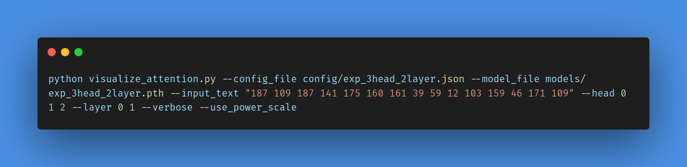

# 🌟 Graph Path Learning with Transformers

This repository contains a project to train Transformers on graph-based data, testing the model's ability to learn paths and perform path searches between source and target nodes. 
Planning is a critical element of human cognition and a fundamental functionality of large language models (LLMs). The study ["ALPINE: Unveiling the Planning Capability of Autoregressive Learning in Language Models"](https://arxiv.org/abs/2405.09220) investigates how Transformer-based LLMs develop planning abilities through next-word prediction.

---

## ⚡ [See Here: A Simple Experiment on Multihead Attention!](experiment.md)

An example of validation execution:

---

## 🔎 Overview

The project includes the following main functionalities:

### 0. 🛠 **Run Data Generation**

**Description**: The `run_data_generation.py` script is designed to create random Directed Acyclic Graphs (DAGs) and extract paths for training and validation. This serves as the foundation for training the Transformer model.

---

### 1. 📊 **Run Training**

**Description**: The `run_gpt_train.py` script trains a GPT-based Transformer model on the generated graph datasets. It uses a configuration file to specify the model architecture and hyperparameters. The training process monitors the training and validation loss, and the final model is saved for future use.

**Key functionality:**
- Loads training and validation datasets.
- Configures the Transformer model based on a JSON configuration file.
- Saves the trained model to disk and generates loss plots.

---

### 2. ✅ **Run Validation**

**Description**: The `run_validation.py` script validates the trained Transformer model by comparing the predicted paths against the DAG structure. It provides metrics such as successful validations, failures, hallucinations, and unreachable paths. Detailed outputs help analyze the model's performance and debug issues.

**Key functionality:**
- Loads the trained model and DAG structure.
- Compares the model's path predictions with the actual paths in the DAG.
- Reports metrics including successful validations, hallucinations, and unreachable paths.

---

### 3. 🎨 **Visualize Attention**

**Description**: The `visualize_attention.py` script visualizes the attention weights of a pre-trained GPT model for a given input sequence. Users can analyze specific layers and heads to understand how the model attends to different tokens in the sequence.

**Key functionality:**
- Displays attention weights for selected Transformer layers and heads.

---

### 4. 🔮 **Visualize Next Token**

**Description**: The `visualize_next_token.py` script predicts the next token probabilities for a given input sequence using a pre-trained GPT model. It generates a visualization of the token probabilities and saves the result as an image.

**Key functionality:**
- Computes and plots the probabilities of the next token in a sequence.
- Allows customization of input text and probability thresholds.

---

## ✨ Key Features

- 🌀 Generates random graphs for diverse testing scenarios.
- 🤖 Transformer-based architecture fine-tuned for graph traversal tasks.
- 📈 Detailed validation output to analyze model performance and error patterns.

---

## References and Acknowledgments

- Sebastian Raschka's books and resources for Transformer implementation.
- Siwei Wang, Yifei Shen, Shi Feng, Haoran Sun, Shang-Hua Teng, Wei Chen. ALPINE: Unveiling the Planning Capability of Autoregressive Learning in Language.

Feel free to explore and contribute to this project!
