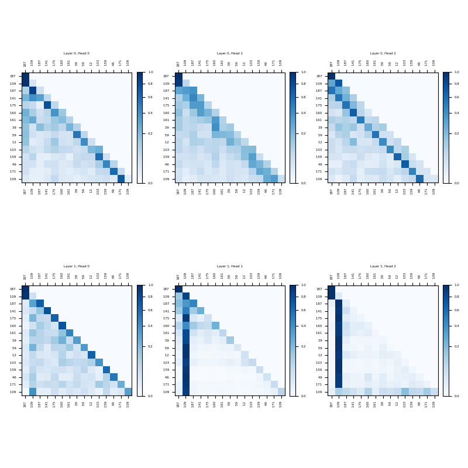
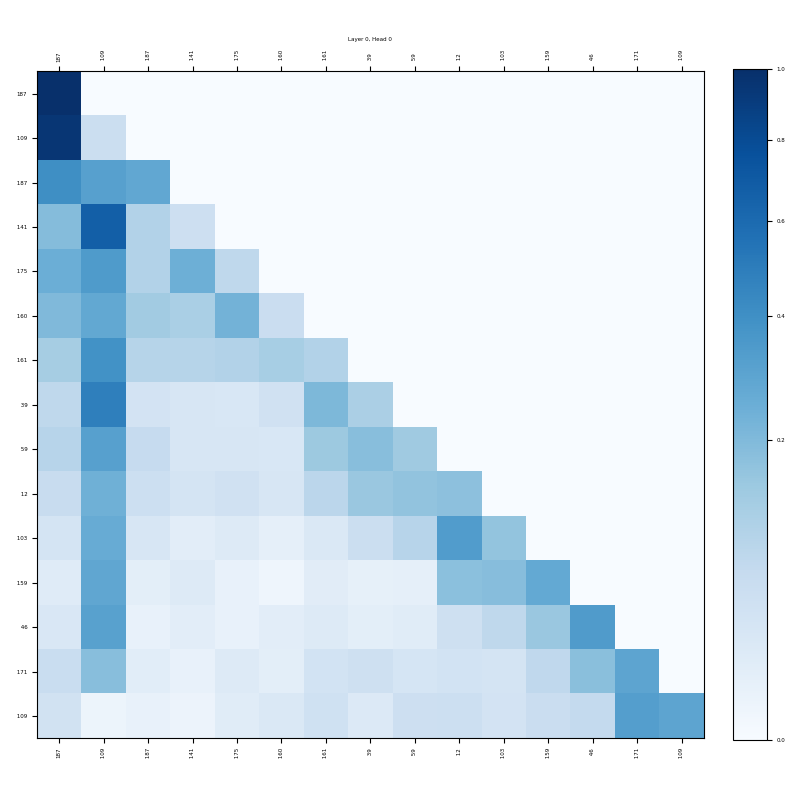

Experiment
---------

One and three attention heads are tested to compare their effectiveness in capturing long and short context relationships. This comparison aims to understand how adding more attention heads impacts the model's performance on various metrics.

### Configuration Comparison

| Parameter       | Single Attention | Multi Attention |
|-----------------|--------|--------|
| vocab_size      | 50000  | 50000  |
| context_length  | 50     | 50     |
| emb_dim         | 120    | 120    |
| n_heads         | **1**      | **3**      |
| n_layers        | **1**      | **2**      |
| drop_rate       | 0.1    | 0.1    |
| qkv_bias        | true   | true   |
| batch_size      | 10     | 10     |
| learning_rate   | 0.0004 | 0.0004 |
| weight_decay    | 0.1    | 0.1    |

### Validation Summary

| Metric                | Single Attention | Multi Attention  |
|-----------------------|--------|--------|
| Successful Validations| 4104   | 4414   |
| Failed Validations    | 376    | 66     |
| Hallucinations        | 5      | 5      |
| Not Reachable         | 371    | 61     |
| Error Percentage      | **9.16%**  | **1.50%**  |

### Attention heads on layers omparision

With a single head, the values for the previous token, source token, and target token remain high. In contrast, when using multiple heads, the second layer specializes in the source and target nodes, while the heads in the first layer capture more sparse relationships in the context.

Another interesting insight arises from the observation of how smooth the attention is when token generation is far from the first token. This indicates more attention is given to the final target, which is the end goal, and perhaps the graph topology that was created.

| Configuration                | Image Path                                |
|------------------------------|-------------------------------------------|
| GPT Config Multi Attention   |         |
| GPT Config Single Attention         |               |

