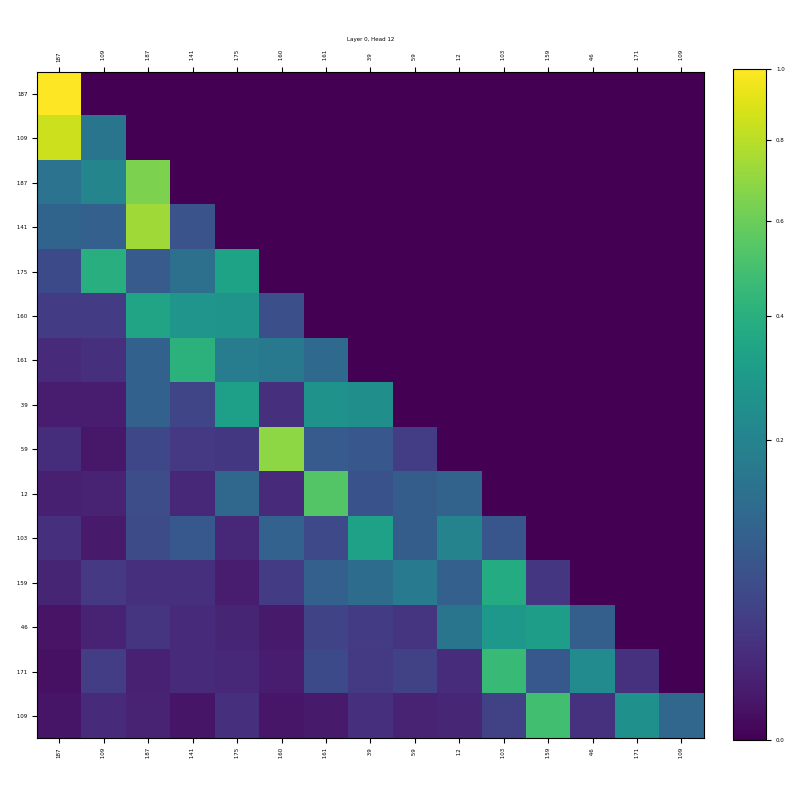
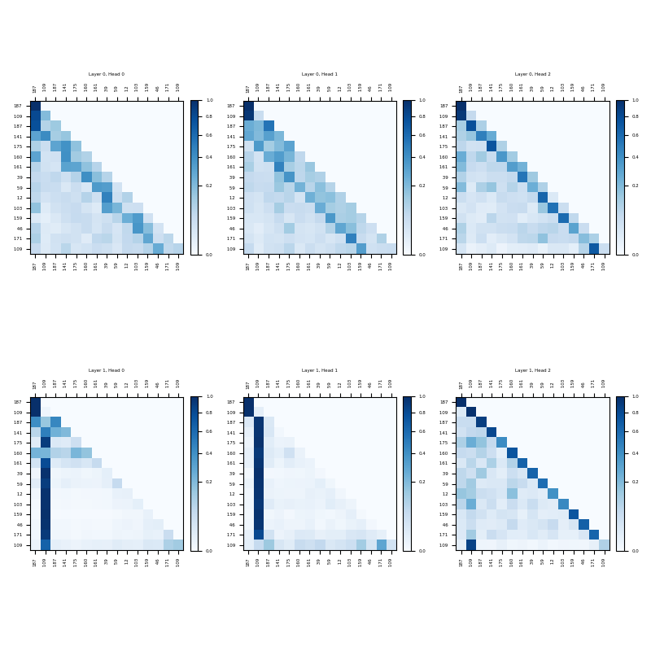
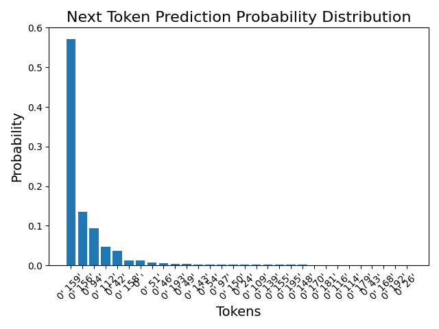
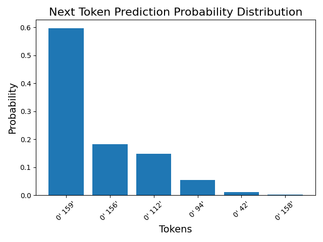

# Experiment Analysis: Transformer Planning Capabilities in Path-Finding Tasks

## Introduction

Planning is a critical element of human cognition and a fundamental functionality of large language models (LLMs). The study ["ALPINE: Unveiling the Planning Capability of Autoregressive Learning in Language Models"](https://arxiv.org/abs/2405.09220) investigates how Transformer-based LLMs develop planning abilities through next-word prediction. This experiment highlights the capability of Transformers to capture short- and long-range relationships in graph-based path-finding tasks, focusing on the interaction between source and target nodes.

---

## Experiment Overview

The experiment models planning as a graph path-finding task. The objective is to generate a valid path from a source node to a target node while evaluating the Transformer's ability to:

1. Capture both local and global context.
2. Focus on critical nodes.
3. Handle the inherent relationships in graph-based structures.

---

## Configuration Details

| Parameter           | Single Attention | Multiple Attention |
|---------------------|------------------|--------------------|
| Vocabulary Size     | 50,000           | 50,000             |
| Context Length      | 50               | 50                 |
| Embedding Dimension | 120              | 120                |
| Number of Heads     | 1                | 3                  |
| Number of Layers    | 1                | 2                  |
| Dropout Rate        | 0.1              | 0.1                |
| QKV Bias            | True             | True               |
| Batch Size          | 10               | 10                 |
| Learning Rate       | 0.0004           | 0.0004             |
| Weight Decay        | 0.1              | 0.1                |

---

## Validation Results

| Metric                 | Single Attention | Multiple Attention |
|------------------------|------------------|--------------------|
| Successful Validations | 4,104            | 4,414              |
| Failed Validations     | 376              | 66                 |
| Hallucinations         | 5                | 5                  |
| Not Reachable          | 371              | 61                 |
| Error Percentage       | 9.16%            | 1.50%              |

---

## Attention Visualization

| Configuration                | Causal Attention Visualization                   |
|------------------------------|--------------------------------------------------|
| GPT Config Single Attention  |          |
| GPT Config Multi Attention   |          |

The analysis of attention mechanisms provides critical insights into Transformer behavior:

### Single Attention Head and Single Layer

- **Mechanism**: This configuration mixes information from the source node, target node, and preceding node, ensuring that the correct path is constructed.
- **Limitation**: As the path is generated, attention on the source node diminishes, reducing its influence on path completion. This suggests that a single attention head and layer struggle to maintain long-term dependencies effectively.

### Multiple Attention Heads and Layers

- **Layer Specialization**:
  - **First Layer**: Broadly focuses on multiple nodes, capturing relationships within the graph's structure.
  - **Second Layer**: Specializes in focusing on the target node, integrating critical information to guide path generation.
- **Outcome**: The specialized roles of layers result in significantly higher accuracy, with each layer contributing distinct but complementary information.

---

## Next Token Probability Generation

| Configuration                | Next Token Probability Distribution              |
|------------------------------|--------------------------------------------------|
| GPT Config Single Attention  |          |
| GPT Config Multi Attention   |          |

The attention mechanism ensures that the generation of the most probable token aligns closely with valid paths, particularly in the multi-head configuration.

---

## Challenges and Limitations

While the experiment demonstrates the strengths of Transformers in graph-based path-finding tasks, several challenges persist:

### Hallucinations

- Both single and multi-head configurations occasionally generate edges that do not exist in the graph, resulting in invalid paths.

### Unreachable Paths

- Certain paths remain unreachable, particularly in complex graph topologies, due to incomplete or erroneous attention assignments.

### Testing Limitations

- The experiment focuses on a limited set of Directed Acyclic Graph (DAG) topologies. Testing on a broader and more diverse set of DAGs is essential to assess the model's generalizability.

---

## Conclusion

This analysis underscores the advantages of multiple attention heads and layers in Transformer models for planning and path-finding tasks. Their ability to specialize allows for improved handling of both local and global context, resulting in higher accuracy and robustness.

### Key Takeaways

- **Strengths**:
  - Multiple attention heads enable smoother attention transitions and greater accuracy.
  - Layer specialization ensures better integration of critical information.

- **Weaknesses**:
  - Challenges such as hallucinations and unreachable paths remain unresolved.
  - Broader testing with more complex graph topologies is necessary for comprehensive evaluation.
